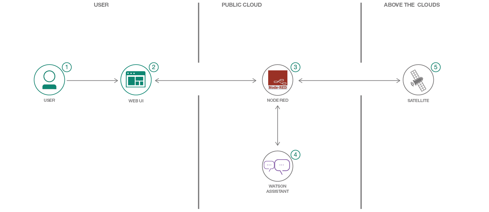

# WORK IN PROGRESS - Please Visit Soon for the Completed Code

[](https://travis-ci.org/IBM/casis-satellite-tracker)
# CASIS Satellite Tracker

In this Code Pattern, we will build a satellite tracker using Node Red and IBM Watson.
A flow will be created for connecting a Watson Assistant Chatbot with a node-red-contrib-satellites node, as well as a web UI and worldmap node.

When the reader has completed this Code Pattern, they will understand how to:

* Build a complex flow and web UI using simple Node Red tools.
* Implement a chatbot with Watson Assistant and embed it on a web page with Node Red.
* Get satellite information for the International Space Station (ISS) and use it in a web app.



## Flow

1. Step 1.
2. Step 2.
3. Step 3.
4. Step 4.
5. Step 5.

## Included components

* [Watson Assistant](https://www.ibm.com/watson/developercloud/conversation.html): Create a chatbot with a program that conducts a conversation via auditory or textual methods.

## Featured technologies

* [Artificial Intelligence](https://medium.com/ibm-data-science-experience): Artificial intelligence can be applied to disparate solution spaces to deliver disruptive technologies.
* [Node.js](https://nodejs.org/): An open-source JavaScript run-time environment for executing server-side JavaScript code.

# Watch the Video

# Steps

## Run locally

1. [Clone the repo](#1-clone-the-repo)
1. [Create Watson services with IBM Cloud](#2-create-watson-services-with-ibm-cloud)
1. [Create a Node Red Workspace](#3-create-a-node-red-workspace)
1. [Import the Conversation workspace](#4-import-the-conversation-workspace)
1. [Configure credentials](#5-configure-credentials)
1. [Run the application](#6-run-the-application)

### 1. Clone the repo

Clone the `casis-satellite-tracker` locally. In a terminal, run:

```
$ git clone https://github.com/IBM/casis-satellite-tracker
```

### 2. Create Watson services with IBM Cloud

Create the following services:

* [**Watson Assistant**](https://console.ng.bluemix.net/catalog/services/conversation)

### 4. Import the Conversation workspace

Launch the **Watson Conversation** tool. Use the **import** icon button on the right

Find the local version of [`data/workspaces/satelliteChat.json`](data/workspaces/satelliteChat.json) and select
**Import**. Find the **Workspace ID** by clicking on the context menu of the new
workspace and select **View details**. Save this ID for later.

*Optionally*, to view the conversation dialog select the workspace and choose the
**Dialog** tab, here's a snippet of the dialog:


### 5. Configure credentials

The credentials for IBM Cloud Watson Assistant service can be found
by selecting the ``Service Credentials`` option for each service.

The other settings for the Assistant Workspace was collected in the
earlier setup step: ``WORKSPACE_ID``.

### 6. Run the application

# Sample output


# Troubleshooting

# Links

* [Demo on Youtube]()

# Learn more

* **Artificial Intelligence Code Patterns**: Enjoyed this Code Pattern? Check out our other [AI Code Patterns](https://developer.ibm.com/code/technologies/artificial-intelligence/).
* **AI and Data Code Pattern Playlist**: Bookmark our [playlist](https://www.youtube.com/playlist?list=PLzUbsvIyrNfknNewObx5N7uGZ5FKH0Fde) with all of our Code Pattern videos
* **With Watson**: Want to take your Watson app to the next level? Looking to utilize Watson Brand assets? [Join the With Watson program](https://www.ibm.com/watson/with-watson/) to leverage exclusive brand, marketing, and tech resources to amplify and accelerate your Watson embedded commercial solution.

# License
[Apache 2.0](LICENSE)
