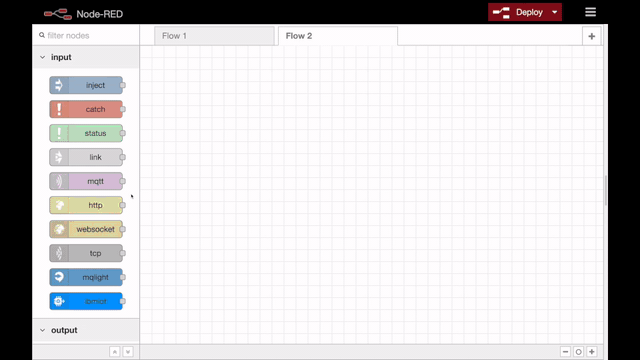

# Build the Node-RED Flow Manually

In order to build the Node-RED flow for the CASIS satellite tracker, you will use the flow editor to add and connect nodes, and put configuration information and code in the appropriate node.

> NOTE: You can move the contents of a file to your Operating System clipboard with:

 `pbcopy < myfile` on MacOS,

 `cat myfile |clip` on Windows, or

 `cat myfile| xclip` on Linux.

> NOTE: You can find nodes in the `filter nodes` search box in the upper left of the flow editor.

<p align="left">
  
</p>

### Create the HTML UI

* In your Node-RED flow editor, drag-and-drop nodes for `HTTP input`, 2 `template` nodes, and `HTTP response` and wire them together.

* Add the [Chat Page JS](../data/nodeContent/ChatPageJS.js) code to the first template node and the [HTML](../data/nodeContent/index.html) code to the second template node and name them accordingly.

* Details are available in the [Create HTML UI video](https://ibm.box.com/s/bqxloubya8slsuh358jtyq1bu4toamx7)


### Create the World Map UI

* In the Node-RED flow editor, drag-and-drop 2 `inject` nodes, 3 `function` nodes, a `satellite` node and a `worldmap-tracks` node.

* Wire them up:


* Double-click both `inject` nodes (labeled `timestamp`) and tick the checkbox for ` Inject once after 0.1 seconds, then`. On the lower one, which feeds the `satellite` node, choose `Repeat` -> `interval` and set the interval to every `1` `minutes`.

<p align="left">
  
</p>

* Double-click the `satellite` node and you should see `Sat. Type` -> `Space Stations` and `Satellite` -> `ISS (ZARYA)`. Click `Done`.

* Double-click the top function node (after the timestamp) and add the code for [add map layer](../data/nodeContent/addMapLayer.js). Name it `add map layer`.

* Double-click the function node after the ISS (ZARYA) satellite node and add the code for [ISS to Map](../data/nodeContent/ISStoMap.js). Name it `ISS to map`.

* Double-click the last function node, after `ISS to map`, and add the code for [move and zoom](..data/nodeContent/moveAndZoom.js). Name it `move and zoom`.

* Details are available in the [Create Worldmap UI video](https://ibm.box.com/s/glu64qw4wfic9im642vcapgwwzn2dcvg)



### Create the Watson Assistant Chat UI

* Grab the following nodes in order, and wire them up in a row. The following 3 groups represent 3 rows:

```
http in
function
assistant
function
satellite
link out

link in
function
credentials
http request
json
link out

link in
function
http response
```

The flow should look like this:


* We'll add `link` nodes to allow them to fit on one screen. Each `link out` can end the row, and a `link in` will start the next one. Double click the first `link out` after creating both `link out` and `link in`, and check the box. You'll see a dotted line connecting the rows.

* Double-click the first node, `http in` and change the Method to `POST` and the URL to `/botchat`

* Double-click the next `function` node, change the name to `Process chat input` and cut-n-paste the [processChatInput.js](../data/nodeContent/processChatInput.js) code.

* Double-click the `Assistant` node, and name it 'ISS Assistant'. Add the `username` and `password`, or the IAM `apikey`, and the `Workspace ID`  that you saved earlier when you created the Watson Assistant service.

* Double-click the final `function` node in the first row, name it `Assistant to Satellite`, and cut-n-paste the [assistantToSatellite.js ](../data/nodeContent/assistantToSatellite.js) code.

* Start the second row by double-clicking on the first `function` node in that row and name it `ISS to reverse geocode function`, and paste the [ISStoReverseGeocode.js](../data/nodeContent/ISStoReverseGeocode.js) code.

* Double click the `credentials` node. Click `+add` under the `Values` box and add the locationIQ API key to the `private` box and change the `to` box to be msg.`API_key`.

* Double click the `http request` node and name it `GET reverse geocode`. In the URL box paste the [getReverseGeocode](../data/nodeContent/getReverseGeocode) URL string.

* The `json` node does not need configuration.

* Begin the third row by double-clicking the `function` node and naming it `Assistant output to chat`. Paste the [assistantOutputToChat.js](../data/nodeContent/assistantOutputToChat.js) code.

* Finally, double-click the `http response` node and name it `Bot response`. Set the status code to `200`.

* Details are available in the [Create Chat UI video](https://ibm.box.com/s/c7lsb2jaol3k7oe49n263ws9880ujh0v)


